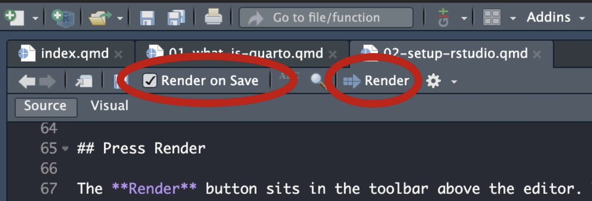

# Setting up in RStudio {#sec-setup}

Duration: ten minutes, once. At the end you will have a real book rendering in front of
you.

There are two ways in, and the second is usually the better one.

## Option A: start from this book {#sec-starter}

**The book you are reading is itself a starter template.** Every chapter in this 
guide is a working demonstration of the thing it describes. Download and
extract the folder below and you inherit all of it: the UU house style, 
a working `_quarto.yml`, a sensible `.gitignore`^[If you will follow the guide and
publish your book on Github pages, this files ensures you do not track every single temporary file
along with the actual contents of the book.], and an example
of each pattern you are likely to need.

[**Download the starter book (.zip)**](starter-book.zip)

## Opening a downloaded folder in RStudio
1. Unzip it somewhere sensible and **rename the folder** to your course.
2. In RStudio: <kbd>File</kbd> → <kbd>New Project…</kbd> → **<kbd>Existing
   Directory</kbd>** → browse to that folder → <kbd>Create Project</kbd>.

   *Existing Directory* is the option people miss, because the wizard's first
   screen pushes you towards *New Directory*. It creates nothing of its own. It
   only tells RStudio "this folder is a project", writes an `.Rproj` file into
   it, and opens it. Everything already in the folder stays exactly as it is.
   (The zip deliberately contains no `.Rproj`, so the one RStudio makes will be
   named after *your* folder.)
3. **Render** your book (see @sec-render below). You should get exactly this web book
   back, running locally. Nothing else needs installing. 
4. Now start replacing. Open `_quarto.yml`, change the title and author, and
   work through the chapters one at a time: keep the scaffolding, delete our
   prose, write yours.

::: {.callout-note}
## What to keep, what to throw away

**Keep:** `_quarto.yml` (although you'll edit the actual chapters), `uu.scss` (uu house style), 
`.gitignore`, and folder structure (e.g. `figures/` and `applets/`). 

**Throw away** once you no longer need them: the specific chapter files for this book, 
and apps/figures only used for this explainer. You can also throw away the `make-starter-zip.R`, 
which was used to package this template. 
:::

## Option B: start from scratch

If you would rather setup your book from an empty folder, which will help you
better understand how it works, you can start one from scratch with RStudio.

## Make the project

<kbd>File</kbd> → <kbd>New Project…</kbd> → <kbd>New Directory</kbd> →
<kbd>Quarto Book</kbd>.

Give the folder a name. Tick **Create a git repository** if you already know
you want to publish it (see @sec-publishing): it is easier to tick now than to
add later. Press **Create**.

RStudio opens the new project, and you are already looking at a working book.

## Press Render {#sec-render}

The **Render** button sits in the toolbar above the editor. The first render
takes a few minutes (depending on the book size); the finished book then 
appears either in the RStudio's Viewer pane or in your web browser (system dependent).
All the HTML files are moved to a folder called `_book` (or later: `docs` — see @sec-yml). 
Note that you can open the HTML files in this directory from your file browser,
and everything will work with one exception: the live code chunks, which
either requires a local webserver (by typing `quarto preview` in the terminal), 
or simply an online copy of your book (see @sec-publishing).

If you use `quarto preview` to show your web book in the browser, there is a neat
little tick-box left of the Render button called `Render on Save`. Now every save refreshes the preview by
itself. 

## Source or Visual?

Note that the toolbar with the render button also contains a <kbd>Source</kbd>/<kbd>Visual</kbd>
toggle.

**Visual** gives you a Word-like view: real bold text, real tables, menus for
inserting figures, equations and cross-references. If you dont want to see any markup at all,
you can live here permanently.

**Source** shows the markup. It is faster once you know it, and it is what the
rest of this guide shows. I do recommend this, with one exception, shown in the 
tip below.

::: {.callout-tip}
## Make tables in Visual mode
Markdown tables are miserable to write by hand and trivial in Visual mode.
Insert one there, then switch back to Source. Or ask AI to convert a table
into markdown^[Please follow the UU guidelines for AI usage; either use the AI platforms
officially endorse by UU, or use a personal account at another platform that is not
linked to your UU e-mail address]. 
:::

## Important elements in a Quarto book folder

| Item | What it is |
|---|---|
| `_quarto.yml` | The book definition: which chapters, in which order, with which theme. **The only file you truly must understand** (see @sec-yml). |
| `index.qmd` | The front page. You cannot rename this file, it is required and it is the 'home page' of your web book. |
| `*.qmd` | One file per chapter. This is where you write. You can enable / disable chapters by modifying `_quarto.yml`. |
| `_book/` | The finished website, generated by Quarto upon rendering. Don't edit these files, they will be overwritten next render anyway. |
| `*.Rproj` | RStudio's project file. Double-click it to reopen the book later. |
| `_freeze/` | Stored results of code that has already been run or rendered, helps speed up rendering later (see @sec-rendering). |
