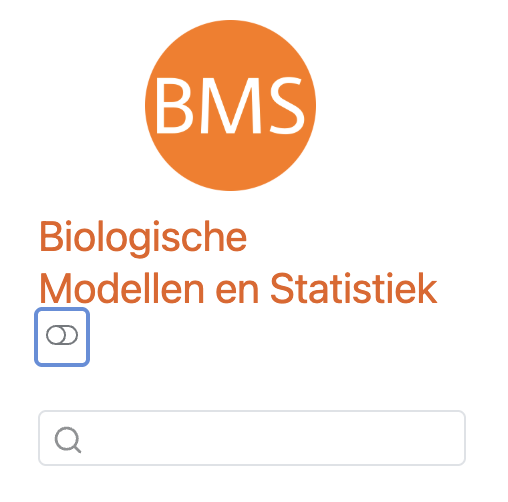

# Almost everything is controlled by one file: `_quarto.yml` {#sec-yml}

This one file is the table of contents, the theme, and the settings. It is probably
good to go through this step by step. Although the rest of working with Quarto
is ust writing, you need to know a little bit about this file. That being said,
if you end up using my template, you mostly need to modify the chapter organisation. If you want
to use your own style, you can change the theme and add your own SCSS. 

## A minimal book

```yaml
project:
  type: book
  output-dir: docs          # where the finished website is written

book:
  title: "My Course Book"
  author: "Your Name, Utrecht University"
  chapters:
    - index.qmd             # the front page
    - part: "Getting started"     # groups chapters under a heading
      chapters:
        - 01-writing.qmd
        - 02-figures.qmd
    - part: "Practicals"
      chapters:
        - 03-practical.qmd
  appendices:               # lettered instead of numbered
    - answers.qmd

format:
  html:
    theme: cosmo            # any Bootswatch theme
    toc: true
  pdf:
    documentclass: scrreprt # delete if you never want a PDF
```

Three blocks matter most:

- **`project`** — what you are building, and where the output goes.
- **`book`** — the structure, and which chapters in which order.
- **`format`** — how each output type looks.


## The side bar

Your book will render each chapter with a navigation sidebar, like the one
you can see to the left right now. Note that a very long chapter title makes 
an ugly sidebar entry. In fact, this specific chapter has a very long title.
Fortunately, you can give the sidebar its own shorter text, which was 
done for this chapter:

```yaml
    chapters:
      - text: "Quarto yml"
        href: 03-quarto-yml.qmd
```

Chapters can also live in subfolders, organising your websites into bigger
chunks of chapters (e.g. part 1 and part 2 of a course). 

## Indentation

YAML indentation is annoyingly strict, and must be **spaces, never tabs**. If Quarto
complains about the file and the message makes no sense, indentation is
almost always the cause. 

## CSS / UU house style {#sec-theming}

You can modify how your book looks by changing the style sheets. Some that
ship with Quarto are `cosmo`, `flatly`and `litera` (all read well as a textbook).
If you are familiar with CSS stylesheet, you can layer that on top:

```yaml
format:
  html:
    theme: [cosmo, uu.scss]
```

That is what this book uses. Quarto will also happily use a light/dark 
pair:

```yaml
    theme:
      light: [cosmo, uu.scss]
      dark:  [darkly, uu-dark.scss]
```


The theme listed as the first is the default, and the reader's choice is remembered in
their browser. Add `respect-user-color-scheme: true` and it follows their
operating system settings instead. 

::: {.callout-note}
## Why this book has no dark mode
The UU identity is specified on a white ground, and has no dark mode counter part.
So I decided not to add it. You can do it for your own book, of course, as we
have done for many of ours (see @fig-bmsdark). 
:::

{#fig-bmsdark width=50%}

## Other options in the yaml 

The yaml has [many other options](https://quarto-tdg.org/yaml.html). With out listing all of them, you can look 
into these:


```yaml
book:
  favicon: figures/favicon.png    # the little (20x20) icon next the web address
  search: true  # search function enabled, really useful for students
  sidebar: # menu to the left
    logo: figures/uu-logo.png # logo's for your course / UU branding
    style: floating # other option: 'docked'
    collapse-level: 1 # how many levels of headings are collapsed (1=all)
    pinned: true # stays visible when scrolling down
  page-footer:
    left: "Utrecht University"
    right: "Quarto 4 UU"

format:
  html:
    toc-location: right  # paragraph menu to the right of web page
    lightbox: true       # click figures to enlarge it
    code-overflow: wrap  # wrap code that contain too many characters
    link-external-newwindow: true # external links are always opening in a new window
```

The official UU logo files are on the
[corporate identity site](https://www.uu.nl/en/organisation/corporate-identity);
download the right variant rather than taking one off a web random website.
