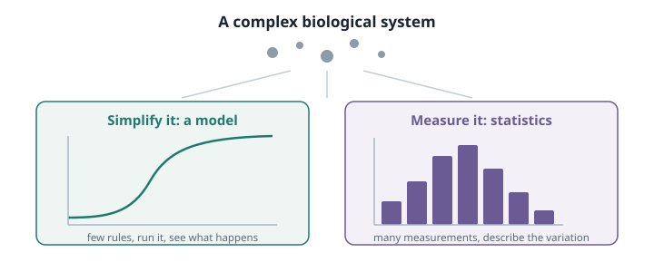

# Figures and tables {#sec-figures}

## Inserting a figure

Put the image in a `figures/` folder next to your chapters, and write one line:

```markdown

```


The text in square brackets is the caption. `` with an empty caption is
allowed, but a caption is nearly always worth writing — it is the part students
read first.

## Sizing, alignment and labels

Options go in curly braces after the image:

```markdown
{#fig-example width=55% fig-align="center"}
```

{#fig-example width=55% fig-align="center"}

`width` is best given as a percentage so it adapts to the reader's screen.
`fig-align` takes `left`, `center` or `right`. The `#fig-` id makes it
@fig-example.

::: {.callout-important}
## `{#example}` does nothing; `{#fig-example}` works
See @tbl-xref. The prefix is what tells Quarto it is looking at a figure.
:::

## Which file format

| For | Use | Because |
|---|---|---|
| Diagrams, schematics, anything you drew | **SVG** or PDF | stays sharp at any zoom, tiny file |
| Photographs, microscopy | **JPG** | small files for continuous tone |
| Screenshots, exported plots | **PNG** | sharp edges, no compression smear |

: Choosing an image format. {#tbl-formats}

Keep images under about 500 kB. A 3 MB photograph makes the page slow for a
student on a phone, and if the book is in Git it stays in the repository
forever.

## Click to enlarge

`lightbox: true` in `_quarto.yml` makes every figure in the book open
full-screen when clicked. No extra markup anywhere — try it on the figure
above.

## Side by side

```markdown
::: {layout-ncol=2}


:::
```

::: {layout-ncol=2}


:::

## Tables

An ordinary Markdown table, with a caption line underneath to make it
referenceable:

```markdown
| Symbol | Meaning | Unit |
|---|---|---|
| $N$ | population size | individuals |
| $r$ | intrinsic growth rate | day$^{-1}$ |
| $K$ | carrying capacity | individuals |

: Parameters of the logistic model. {#tbl-parameters}
```

| Symbol | Meaning | Unit |
|---|---|---|
| $N$ | population size | individuals |
| $r$ | intrinsic growth rate | day$^{-1}$ |
| $K$ | carrying capacity | individuals |

: Parameters of the logistic model. {#tbl-parameters}

Which is @tbl-parameters.

::: {.callout-tip}
## Don't write these by hand
Markdown tables are miserable to type and trivial to insert in RStudio's
**Visual** editor. Switch, insert, switch back.

For a table generated from data, a chunk with `knitr::kable()` (or `DT` for a
searchable, paginated one) is better than pasting numbers in — it stays correct
when the data changes.
:::
