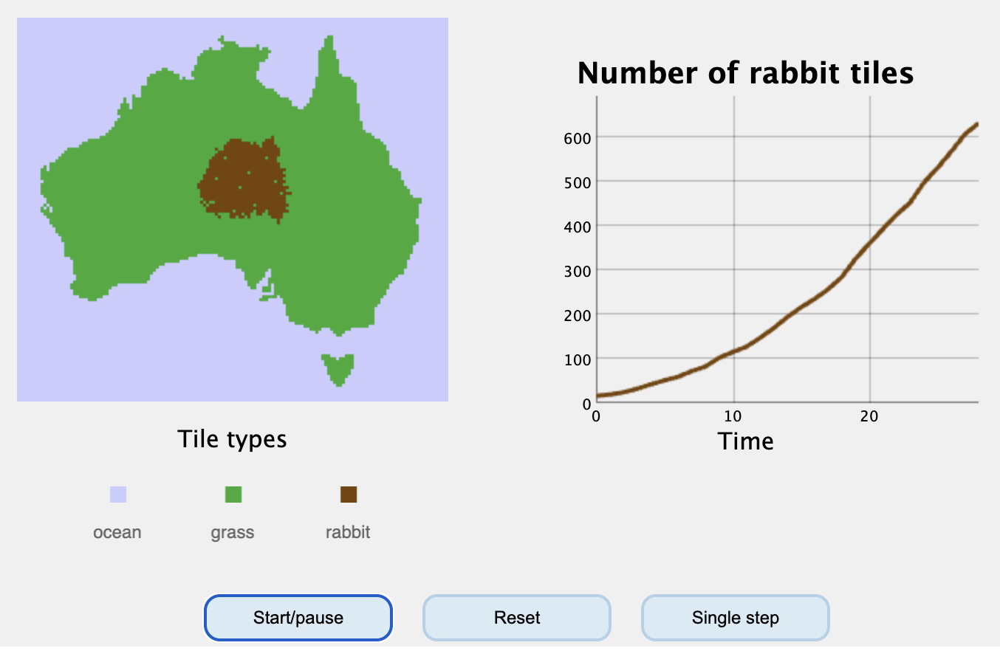

# Embedding interactive content {#sec-iframes}

An **iframe** is a whole webpage shown inside a box on your page. It's a tiny
website inside your website. It is the single most useful trick in our course books, 
because it lets you develop independent "apps" that you can then drop in the 
middle of the book. 

There are two flavours, written almost identically:

**External** — you point at a page on someone else's server: Desmos for mathmatics,
YouTube for videos, JSFiddle for javascript simulations, or one of my many [other simulations](tbb.bio.uu.nl/bvd/simulations).

**Internal** — you point at an HTML file that lives inside your own project.
Nothing external is involved and it keeps working forever. If you^[With or without the help of our robot overlords] develop your own
little app, you can ship it with your book. 

## How to embed iframes

Raw HTML must be wrapped into a `{=html}` block, or Quarto escapes it and
students see the angle brackets:

````markdown
```{=html}
<iframe src="…" width="100%" height="600"
        style="border:none; border-radius:8px;">
</iframe>
```
````

`width="100%"` makes it responsive to the page width (similar to images, probably
a great idea with students looking at your content on phones and laptops alike). 
`height` is typically fixed for my embeddings. The inline `style` (no border, rounded corners, a little vertical
margin) is what makes an embedded tool look like part of the page rather than a
box someone dropped in.

::: {.callout-important}
## Add a screenshot for the printed version
As discussed in the previous section, an iframe cannot exist on paper. Wrap every one of them in
`::: {.content-visible when-format="html"}` and give the PDF a screenshot and a
link instead — see @sec-pdf. Otherwise the PDF gets a mysterious blank gap, or worse,
something half cut-off or overlapping with your book's content. The simulation below 
has a replacement: if you press print now, you will see the stale image appear with
a remark that this interactive content is only available on the website.
:::

## External: a simulation on another server

::: {.screen-only}
```{=html}
<iframe src="https://tbb.bio.uu.nl/bvd/simulations/australia/"
        width="100%" height="560"
        title="Rabbits in Australia"
        style="border:none; border-radius:8px;">
</iframe>
```
:::

::: {.print-only}
**Simulation: rabbits in Australia.** The interactive version is at
<https://tbb.bio.uu.nl/bvd/simulations/australia/> 

:::

```html
<iframe src="https://tbb.bio.uu.nl/bvd/simulations/australia/"
        width="100%" height="560" title="Rabbits in Australia"
        style="border:none; border-radius:8px;"></iframe>
```

## External: a Desmos graph

Build the graph on [desmos.com/calculator](https://www.desmos.com/calculator),
press **Share**, and use the URL you are given (something like 
`https://www.desmos.com/calculator/qxycdqwsdq`) directly as the `src`.
Students can then drag its sliders inside your book. We use these
quite often for students that struggle with maths. 


```html
<iframe src="https://www.desmos.com/calculator/qxycdqwsdq"
        width="100%" height="467"
        style="border:1px solid #ccc;" frameborder="0"></iframe>
```

Give you:

```{=html}
<iframe src="https://www.desmos.com/calculator/qxycdqwsdq"
        width="100%" height="467"
        style="border:1px solid #ccc;" frameborder="0"></iframe>
```


## External: a video

Do not hand-write an iframe for YouTube. Quarto has a shortcode that does it
properly, including on phones:

```markdown
{}
```

Give you: 



## External: code students can edit and run

[JSFiddle](https://jsfiddle.net) hosts a small program together with its
output. Append `/embedded/result` to the share URL for output only, or
`/embedded/js,result` to show the code beside it so students can change a
parameter and press Run.

```html
<iframe src="https://tbb.bio.uu.nl/bvd/simulations/cooperation/"
        width="100%" height="600" title="Simulation"></iframe>
```

Give you:

```{=html}
<iframe src="https://tbb.bio.uu.nl/bvd/simulations/cooperation/"
        width="100%" height="600" title="Simulation"></iframe>
```

::: {.callout-warning}
## External things break
Fair warning: every external iframe relies on that web page staying online. 
Servers move, accounts expire, embedding gets blocked... Probably check
any external links at the start of each course year, and for anything
students are assessed on, best to make it internal.
:::

## Internal: an applet inside your own book

One self-contained `.html` file in a folder in your project. The `src` is then
just a relative path:

````markdown
```{=html}
<iframe src="applets/example-applet.html"
        width="100%" height="620"
        title="Logistic growth explorer"
        style="border:none; border-radius:8px; margin:1em 0;">
</iframe>
```
````

Which gives you what you see below, a real applet, running inside this page:

::: {.screen-only}
```{=html}
<iframe src="applets/example-applet.html"
        width="100%" height="620"
        title="Logistic growth explorer"
        style="border:none; border-radius:8px; margin:1em 0;">
</iframe>
```
:::

::: {.print-only}
**Applet: logistic growth explorer.** Sliders for $r$, $K$ and $N_0$, with the
resulting trajectory. Open the book in a browser to use it.
:::

Notice that this does not transfer well to a printed version of your book, but there
is a solution. See @sec-printing.

