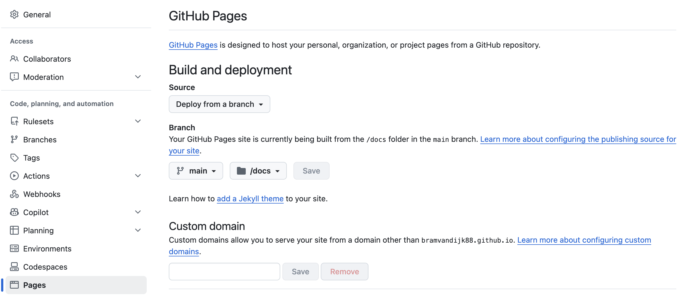

# Putting it online {#sec-publishing}

Once it renders, your book is just a folder of static files. Any web server can
host it, including many free ones.

## Three routes

| Route | Effort | Good for |
|---|---|---|
| **GitHub Pages** | Set up once, then Commit + Push | A course book you will keep editing. Free, versioned, and a colleague can contribute. |
| **A UU server** | Ask your local support to host the folder | Something that must live under a `uu.nl` address. The BMS book is served this way. |
| **Your own server** | Reupload every time, or write your own automated script | A quick demo or a one-off hand-out. |

The rest of this chapter is the first option: the GitHub Pages route. 

## The idea

Your book folder becomes a *repository*: a folder that GitHub keeps a copy of.
You render the website into a subfolder called `docs`, send it to GitHub, and
tell GitHub to serve that folder as a website. Some of the steps below already
apply to this template, but you will need to do them again for your own book. 

## Step by step

**1. Point Quarto at `docs`.** In `_quarto.yml`:

```yaml
project:
  type: book
  output-dir: docs
```

Render once. The finished website now appears in `docs/`.

**2. Add a file called `.nojekyll`.** An empty file, inside `docs/`. 
GitHub runs its own processor over whatever folder it publishes, and that 
processor quietly drops directories whose names begin with an underscore,
which is most of what Quarto generates. This file switches it off.

In RStudio: <kbd>File</kbd> → <kbd>New File</kbd> → <kbd>Text File</kbd>, then
<kbd>Save As</kbd>, navigate **into `docs/`**, and give it exactly that name,
leading dot included^[Rstudio may complain, but ignore this and create the file]. 
Nothing appears in the Files pane afterwards (a leading
dot means hidden). It is there; *⚙* → *Show Hidden Files* will show it.

Note: rendering again does **not** remove this file, so this step only needs to happen once per book. 

**3. Make the folder a repository.** If you did not tick "Create a git
repository" when making the project: <kbd>Tools</kbd> → <kbd>Project Options</kbd>
→ <kbd>Git/SVN</kbd> → set version control to *Git*, and restart RStudio. A
**Git** tab appears next to Environment and History.

**4. Create the repository on GitHub and connect it.** Make a free account,
press <kbd>New repository</kbd>, give it a name, choose a public repository^[Note: this means your raw .qmd files are public, so if you wish to keep them private, choose a different route of publishing your website.]. Do not add anything
to the repository (no Readme, no gitignore). Then, you can either run a few terminal
commands to get your book uploaded^[Assuming git is installed, the commands would be `git remote add origin https://github.com/USERNAME/REPOSITORY.git`, 
`git branch -M main`, and `git push -u origin main`]. If you wish to avoid the scary terminal and the messiness of git, install [GitHub Desktop](https://desktop.github.com), choose *Add existing repository*, point it at your book folder, then press *Publish repository*. If 
you already added something (like a licence) upon making your repository, you may need to first *Fetch* and then *Publish*. If you get stuck,
AI does a great job debuggin you when you give it the error messages. 

**5. Send your work up.** From then on, in RStudio's **Git** tab or in GitHub
Desktop: tick the changed files, write a one-line message saying what you
changed, press <kbd>Commit</kbd>, then <kbd>Push</kbd>. Those three actions are
the whole of Git for this purpose, and all the setup above will no longer be 
necessary. 

**6. Switch the website on.** On github.com, in your repository:
<kbd>Settings</kbd> → <kbd>Pages</kbd> → under *Build and deployment*, set
Source to *Deploy from a branch*, choose your main branch, and set the folder to
**`/docs`**. Save.

{#fig-ghpages}


A few minutes later your book is live at `https://<your-username>.github.io/<repository-name>/`.
Note that it is also possible to make a separate Gibhub account for your website, 
and host is with a domain name like we have for some of our course books (e.g. `https://bioms-uu.github.io/`).
The workflow is similar, but you can only have 1 github account per email address, so you may need to 
create a new email address for this.

::: {.callout-tip}
## Now the workflow is simple:

Write on your chapters. Render book. Commit changed files. Push to github. 
The website updates automatically within a minute or two. 

:::


## Note that the Github repository has to be public

A GitHub Pages site is visible to anyone with the link to the repository. This
means that even files that you never added to the book (not listed in `_quarto.yml`),
are public too. 

::: {.callout-warning}

Keep exam questions, model answers you do not want found, and anything with
student data **out of the book folder entirely**. Not merely unlisted: out.
Answer chapters that are *meant* to be public are fine; the danger is the file
you forgot was in there.
:::

To help you out, note that the file `.gitignore` helps to keep generated and 
personal files out of the repository. A sensible starting point is shipped
with this book:

```
.Rproj.user/
.Rhistory
.RData
.DS_Store

/.quarto/
_book/
**/*.quarto_ipynb
**/*_cache/

*.aux
*.log
*.toc
```

Note that `_freeze/` is deliberately **not** ignored, as this can help you and 
your colleague not needing to re-render each others files. See @sec-rendering.
