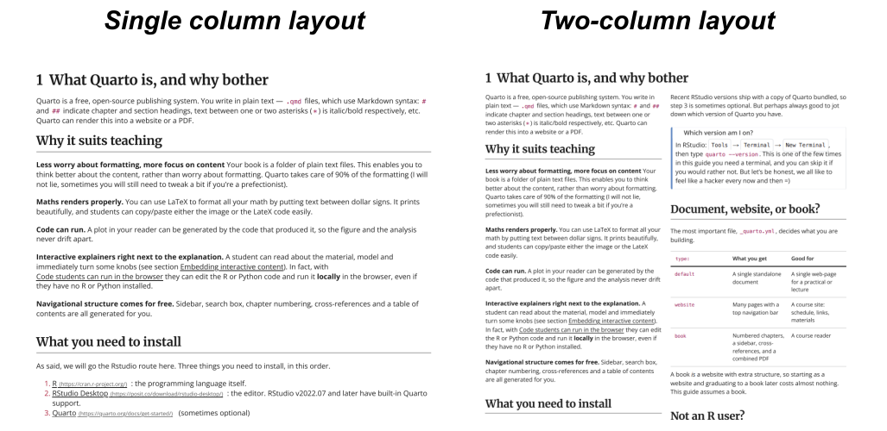

# Print book 🖨️ {.unnumbered}

::: {.screen-only}
This is the whole book in one document, so that a single print gives you
everything rather than one chapter at a time. Nothing here is a second copy:
the chapters are pulled straight from the same sources as the chapter pages,
so this page cannot fall behind them.

Pick a layout and the print dialog opens:

```{=html}
<div class="print-choices">
  <button type="button" onclick="printBook('print-1col')">
    🖨️ One column
  </button>
  <button type="button" onclick="printBook('print-2col')">
    🖨️ Two columns, smaller type
  </button>
</div>
<script>
  function printBook(mode) {
    const root = document.documentElement;
    root.classList.remove('print-1col', 'print-2col');
    root.classList.add(mode);
    window.print();
  }
  // Leave no trace on screen once the dialog closes.
  window.addEventListener('afterprint', function () {
    document.documentElement.classList.remove('print-1col', 'print-2col');
  });
</script>
```


**One column** is the readable default: full-width text, and the side-by-side
figure panels stay side by side. See left-hand side of image below.

**Two columns** fits noticeably more text on a sheet, which is worth real money
if students pay to print it. The type comes down a little with the measure, and
the side-by-side panels stack rather than squeeze into half a column. Wide code
blocks and long equations are the things to check before committing to it. See right-hand side of image below.

::: {.print-preview}
{fig-alt="One-column and two-column print layouts compared"}
:::

Either way the book opens on a cover page and every chapter starts on a fresh
sheet. Pressing <kbd>Cmd</kbd>/<kbd>Ctrl</kbd>+<kbd>P</kbd> without using a
button gives you the one-column version.
:::

```{=html}
<style>
/* This page is an unnumbered chapter, which makes Quarto drop numbering for
   the whole document -- including every chapter pulled in below. The numbers
   still matter though: "What Quarto is, and why bother" is chapter 1 on the
   website and must be chapter 1 here too. So they are counted back in.
   Welcome and About carry .unnumbered from their own headings and are
   skipped, exactly as they are in the sidebar. Scoped to this page. */
main { counter-reset: chapnum; }
main > section.level1:not(.unnumbered) > h1::before {
  counter-increment: chapnum;
  content: counter(chapnum) "\00a0\00a0";
}

@media print {
  /* The page's own heading is screen furniture -- on paper the book opens
     on its cover instead. Scoped here, so a single chapter still prints
     with its own title. */
  #title-block-header { display: none !important; }
}
</style>
```

::: {.cover-page}
{.cover-logo .nolightbox fig-alt="Utrecht University"}

[]{.cover-title}

[]{.cover-subtitle}

[]{.cover-author}
:::






























